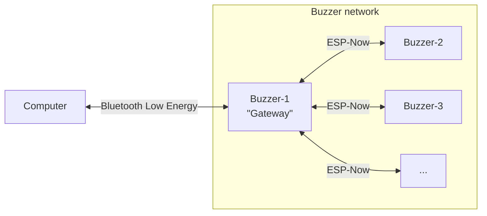
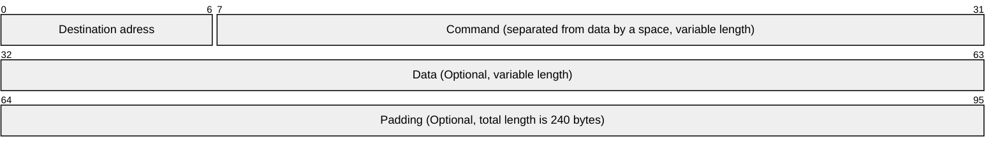

# General description

This project is a request from Insagora club, realised in associon with Club Robot and Club Info.

It consists of a set of buzzers (ESP-32 based) communicating with a PC backend and a web frontend.

# Contacts

Club Info: <[club.info@amicale-insat.fr](mailto:club.info@amicale-insat.fr)> 
Club Robot: <[club.robot@amicale-insat.fr](mailto:club.robot@amicale-insat.fr)>

Main developper: Clément Duran <[clementduran0@gmail.com](mailto:clementduran0@gmail.com)>

# Manual

> [!TOOD]

# Technical specifications

## Hardware

> [!TOOD]

## Software
### Communication diagram

### Computer to gateway communication

All packets sent from the computer follow the same general PDU:

Data are raw bytes.
Broadcast address is `\xFF\xFF\xFF\xFF\xFF\xFF` (or more human-readable `ff:ff:ff:ff:ff:ff`).

### Gateway to computer communication

Communication from gateway to computer isn't normalized.
Max size is 247 bytes.

It is made from `data` field of a `ESPNowMessage` where `fwd_ble` is `1`.

### Between multiple ESP

All packets through the ESP-NOW network are currently sent to broadcast address (`ff:ff:ff:ff:ff:ff`).

Each of them is a `ESPNowMessage`.

Structure of `ESPNowMessage`:
- `char fwd_ble`: Represent if the message should be forwarded through BLE network when it reaches the gateway. 
To forward it, set its value to `1`, else set it to `0`.
- `char target[6]`: Contain the target ESP MAC address for this packet. 
Set it to `{0xff, 0xff, 0xff, 0xff, 0xff, 0xff}` for a broadcast message. 
For this purpose, you can use the `broadcastAddress` constant.
- `char data[240]`: The raw data of this packet. 
If you're sending a command and its data, separate them with a space.

> [!TOOD]
>
> List of commands + sequence diagram

### On board

> [!TOOD]

### Backend

> [!TOOD]

### Frontend

> [!TOOD]
