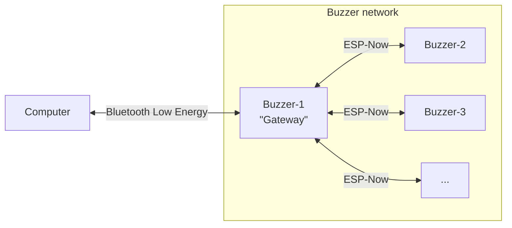

# General description

This project is a request from Insagora club, realised in associon with Club Robot and Club Info.

It consists of a set of buzzers (ESP-32 based) communicating with a PC backend and a web frontend.

# Contacts

Club Info: <[club.info@amicale-insat.fr](mailto:club.info@amicale-insat.fr)> 
Club Robot: <[club.robot@amicale-insat.fr](mailto:club.robot@amicale-insat.fr)>

Main developper: Clément Duran <[clementduran0@gmail.com](mailto:clementduran0@gmail.com)>

# Manual

> [!TOOD]

# Technical specifications

## Hardware

> [!TOOD]

## Software
### Communication

> [!TOOD]
>
> List of commands + sequence diagram

### On board

> [!TOOD]

### Backend

> [!TOOD]

### Frontend

> [!TOOD]
