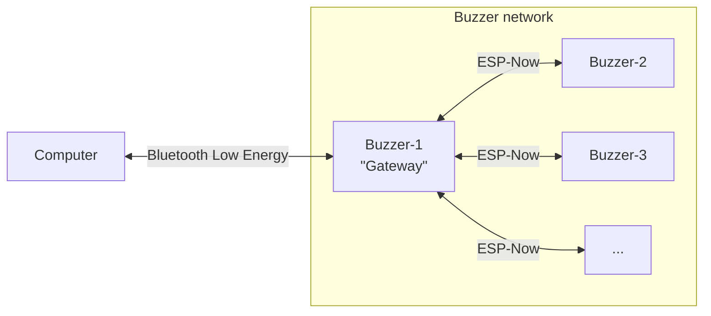
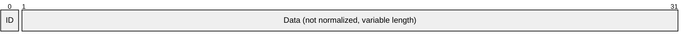
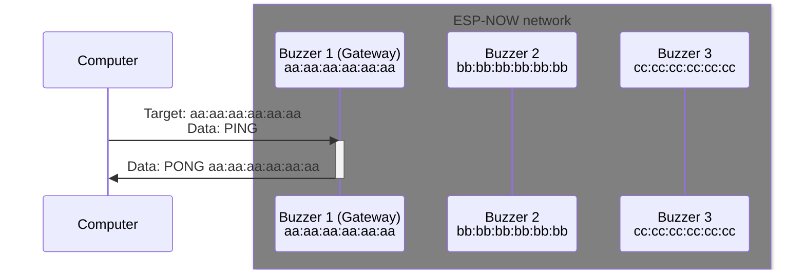
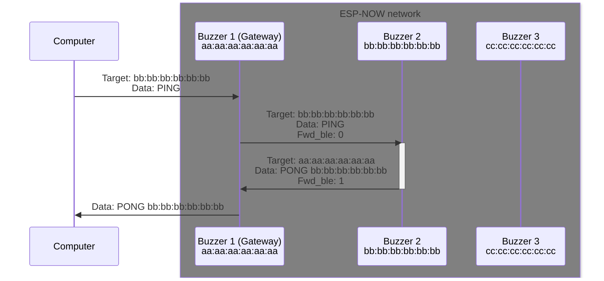
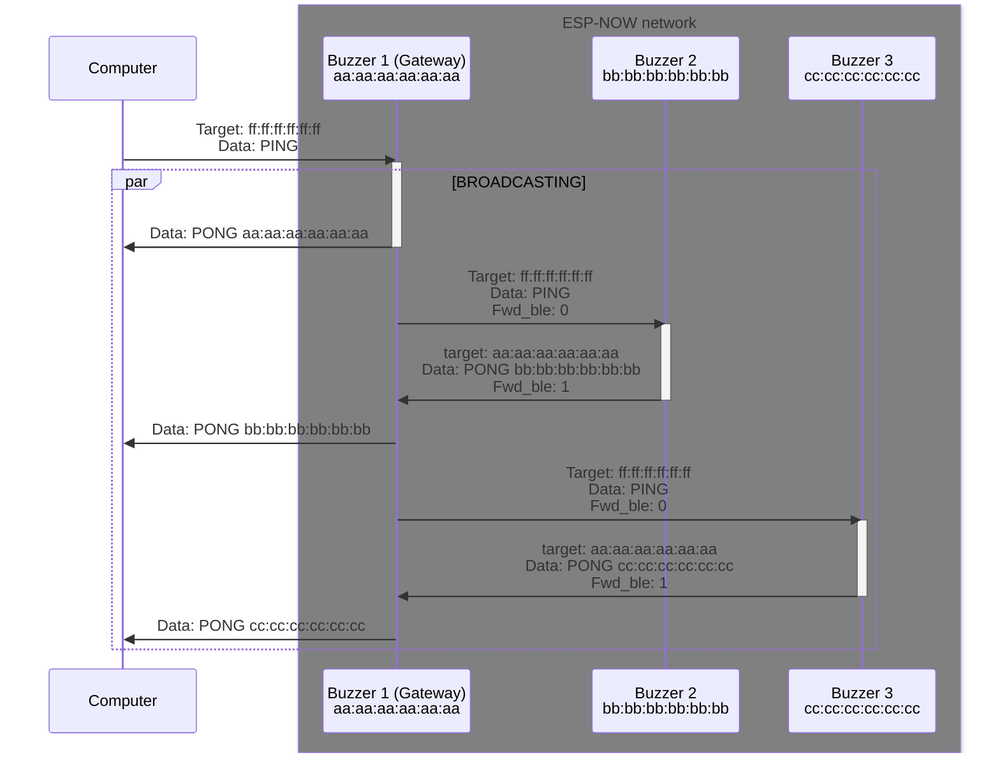

# General description

This project is a request from Insagora club, realised in associon with Club Robot and Club Info.

It consists of a set of buzzers (ESP-32 based) communicating with a PC backend and a web frontend.

# Contacts

Club Info: <[club.info@amicale-insat.fr](mailto:club.info@amicale-insat.fr)><br>
Club Robot: <[club.robot@amicale-insat.fr](mailto:club.robot@amicale-insat.fr)>

Main developper: Clément Duran <[clementduran0@gmail.com](mailto:clementduran0@gmail.com)>

# Manual

> [!TOOD]

# Technical specifications

## Hardware

> [!TOOD]

## Software
### Communication diagram



### Computer to gateway communication

All packets sent from the computer follow the same general PDU:


Data are raw bytes.
Broadcast address is `\xFF\xFF\xFF\xFF\xFF\xFF` (or more human-readable `ff:ff:ff:ff:ff:ff`).

ID refers to a command ID, used for polling responses in backend.

### Gateway to computer communication

Communication from gateway to computer isn't totally normalized.



Max data size is 240 bytes.

It is made from `data` field of a `ESPNowMessage` where `fwd_ble` is `1`.

### Between multiple ESP

All packets through the ESP-NOW network are currently sent to broadcast address (`ff:ff:ff:ff:ff:ff`).

Each of them is a `ESPNowMessage`.

Structure of `ESPNowMessage`:
- `char fwd_ble`: Represent if the message should be forwarded through BLE network when it reaches the gateway.<br>
To forward it, set its value to `1`, else set it to `0`.
- `char target[6]`: Contain the target ESP MAC address for this packet.<br>
Set it to `{0xff, 0xff, 0xff, 0xff, 0xff, 0xff}` for a broadcast message.<br>
For this purpose, you can use the `broadcastAddress` constant.
- `char data[240]`: The raw data of this packet.<br>
If you're sending a command and its data, separate them with a space.

### Example communication

In the following example, we suppose we have a generic `PING` command where respond is in the form `PONG [destination MAC address]`.

#### Example 1: direct command to gateway



#### Example 2: command to a specific buzzer



#### Example 3: command to every buzzers




### Commands
#### Ping

Command used to ping any ESP.
Response contains the target MAC address (in this example : `AA:BB:CC:DD:EE:FF`).

> Command : `PING`
> Response : `PING AA:BB:CC:DD:EE:FF`

#### Get clock

Command used to get internal clock value.
If internal clock is not set, its value will be `INT64_MAX` (9,223,372,036,854,775,807)

In this example, MAC address is `AA:BB:CC:DD:EE:FF`, its internal clock is `1234`.

> Command : `GCLK`
> Response: `GCLK AA:BB:CC:DD:EE:FF 1234`

#### Reset clock

Reset an ESP internal clock.

For the master, default value is `0`.
For another ESP, default value is `INT64_MAX` (9,223,372,036,854,775,807).

This command does not send any response.

> Command: `RCLK`

#### Set clock

Command used to set internal clock.
This command does not send any response.

The internal clock is only set if new clock value is less than actual clock value.

In this example, we set the internal clock to `1234`.

> Command: `SCLK 1234`

#### Automatic set clock

Command used to delegate the set clock procedure to the master ESP.
This will execute the following commands:

1. `RCLK` (broadcast)
2. `SCLK actual_clock` (broadcast, actual_clock being the clock of master)

The `SCLK` is repeated a number of time defined by `AUTO_SET_CLK_NB` in `cmd-clock.cpp`.

> Command: `ACLK`
> Response: `ACLK success`

#### Get LED number

This command return the number of LED installed on a buzzer.

In this example, we suppose the buzzer have 8 LEDs.

> Command: `GLED`
> Response: `GLED 8`

#### Set LED

This command set the LEDs color on a buzzer.
This command does not send any response.

Each LED color is represented on 3 bytes in raw value.

Its PDU is defined as following:


For the next example, there is a quick reminder from extended ASCII codes:
```
ASCII -> DEC | HEX
!     -> 33  | 0x21
ÿ     -> 255 | 0xff
```

In this example, I have a buzzer with 3 LED, and I want to set them to `0xFF2121`, `0x21FF21` and `0x2121FF`. This translate into `ÿ!!`, `!ÿ!` and `!!ÿ`.

> Command: `SLED ÿ!!!ÿ!!!ÿ`

#### Clear LED

This command turn off all LEDs on a buzzer.
This command does not send any response.

> Command: `CLED`

### On board

#### Which callback to use for communication?

For every communication (from master buzzer or other buzzers), send messages using `esp_now_send_message` (defined in `esp-now.h`).

#### How to add a command?

If you want to add commands, you need to define a callback with this signature:

```cpp
void MyAwesomeCommand(ESPNowMessage message);
```

The message passed is the original message.
You then need to add it in `commands_handler` (`commands_handler.h`).

### Backend

> [!TOOD]

### Frontend

> [!TOOD]

# License

> [!TOOD] Add header in every file

This project is distribued under the MIT license.
For more information: https://opensource.org/licenses/MIT
