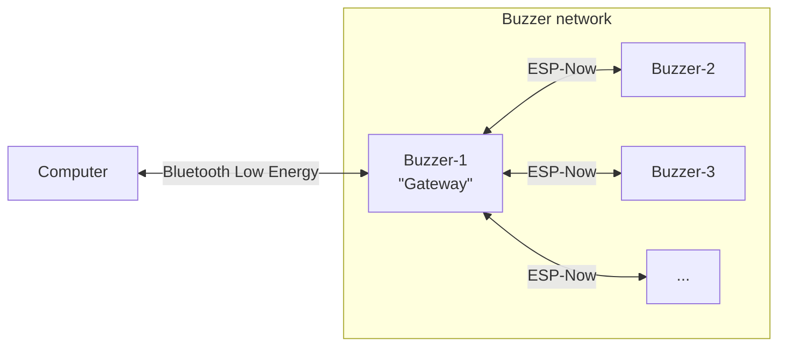
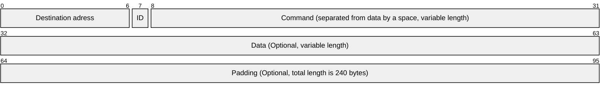
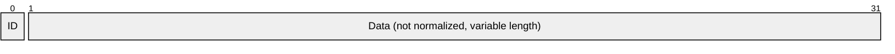
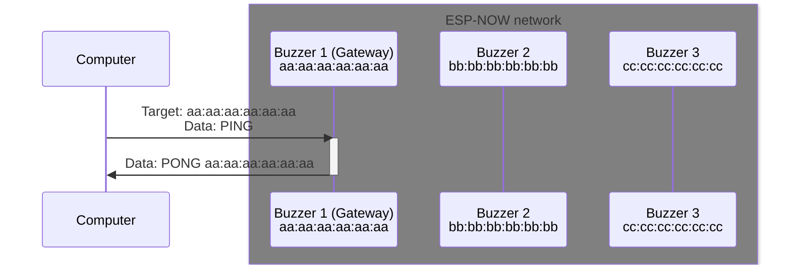
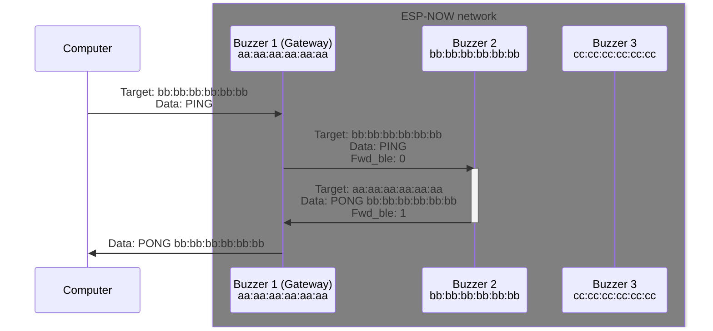
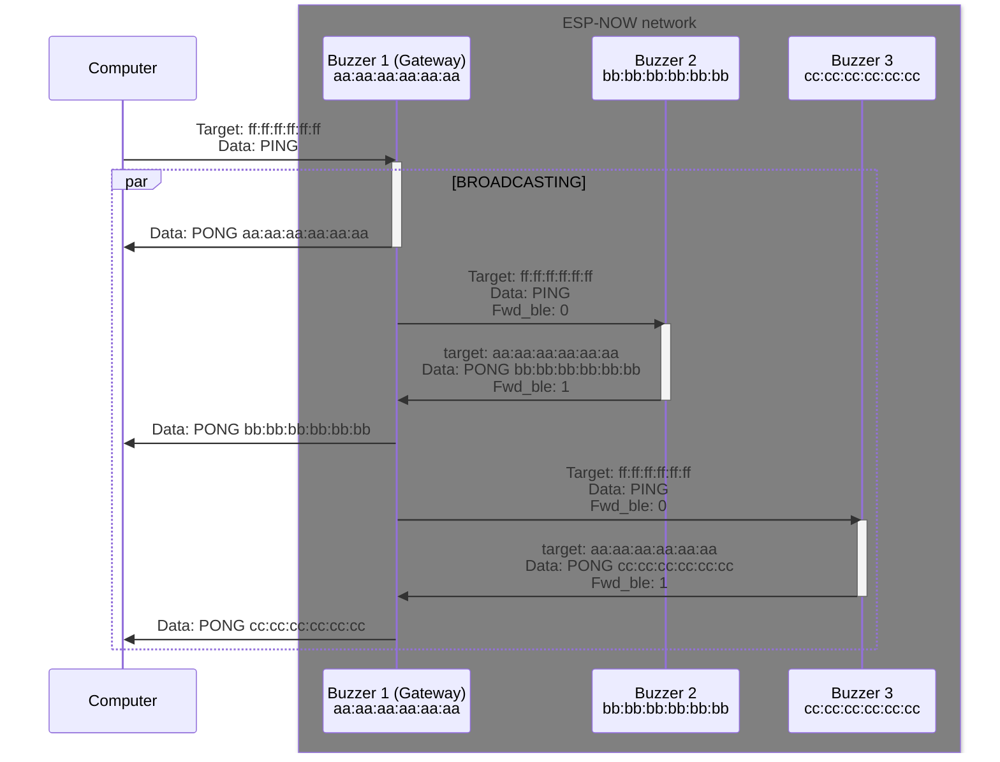
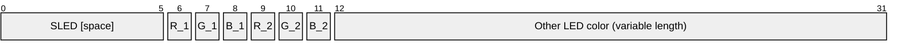

# General description

This project is a request from Insagora club, realised in associon with Club Robot and Club Info.

It consists of a set of buzzers (ESP-32 based) communicating with a PC backend and a web frontend.

# Contacts

Club Info: <[club.info@amicale-insat.fr](mailto:club.info@amicale-insat.fr)><br>
Club Robot: <[club.robot@amicale-insat.fr](mailto:club.robot@amicale-insat.fr)>

Main developper: Clément Duran <[clementduran0@gmail.com](mailto:clementduran0@gmail.com)>

# Manual

> [!TOOD]

# Technical specifications

## Hardware

> [!TOOD]

## Software
### Communication diagram


```mermaid
flowchart LR
    A[Computer] <-->|Bluetooth Low Energy| B[Buzzer-1<br>&quot;Gateway&quot;]
    subgraph Buzzer network
        B <-->|ESP-Now| C[Buzzer-2]
        B <-->|ESP-Now| D[Buzzer-3]
        B <-->|ESP-Now| E[...]
    end
```

### Computer to gateway communication

All packets sent from the computer follow the same general PDU:


```mermaid
packet
0-6: "Destination adress"
7: "ID"
8-31: "Command (separated from data by a space, variable length)"
32-63: "Data (Optional, variable length)"
64-95: "Padding (Optional, total length is 240 bytes)"
```

Data are raw bytes.
Broadcast address is `\xFF\xFF\xFF\xFF\xFF\xFF` (or more human-readable `ff:ff:ff:ff:ff:ff`).

ID refers to a command ID, used for polling responses in backend.

### Gateway to computer communication

Communication from gateway to computer isn't totally normalized.


```mermaid
packet
0: "ID"
1-31: "Data (not normalized, variable length)"
```

Max data size is 240 bytes.

It is made from `data` field of a `ESPNowMessage` where `fwd_ble` is `1`.

### Between multiple ESP

All packets through the ESP-NOW network are currently sent to broadcast address (`ff:ff:ff:ff:ff:ff`).

Each of them is a `ESPNowMessage`.

Structure of `ESPNowMessage`:
- `char fwd_ble`: Represent if the message should be forwarded through BLE network when it reaches the gateway.<br>
To forward it, set its value to `1`, else set it to `0`.
- `char target[6]`: Contain the target ESP MAC address for this packet.<br>
Set it to `{0xff, 0xff, 0xff, 0xff, 0xff, 0xff}` for a broadcast message.<br>
For this purpose, you can use the `broadcastAddress` constant.
- `char data[240]`: The raw data of this packet.<br>
If you're sending a command and its data, separate them with a space.

### Example communication

In the following example, we suppose we have a generic `PING` command where respond is in the form `PONG [destination MAC address]`.

#### Example 1: direct command to gateway


```mermaid
sequenceDiagram
    participant C as Computer
    box Grey ESP-NOW network
        participant G as Buzzer 1 (Gateway)<br>aa:aa:aa:aa:aa:aa
        participant B2 as Buzzer 2<br>bb:bb:bb:bb:bb:bb
        participant B3 as Buzzer 3<br>cc:cc:cc:cc:cc:cc
    end

    C->>G: Target: aa:aa:aa:aa:aa:aa<br>Data: PING
    activate G
    G->>C: Data: PONG aa:aa:aa:aa:aa:aa
    deactivate G
```

#### Example 2: command to a specific buzzer


```mermaid
sequenceDiagram
    participant C as Computer
    box Grey ESP-NOW network
        participant G as Buzzer 1 (Gateway)<br>aa:aa:aa:aa:aa:aa
        participant B2 as Buzzer 2<br>bb:bb:bb:bb:bb:bb
        participant B3 as Buzzer 3<br>cc:cc:cc:cc:cc:cc
    end

    C->>G: Target: bb:bb:bb:bb:bb:bb<br>Data: PING
    G->>B2: Target: bb:bb:bb:bb:bb:bb<br>Data: PING<br>Fwd_ble: 0
    activate B2
    B2->>G: Target: aa:aa:aa:aa:aa:aa<br>Data: PONG bb:bb:bb:bb:bb:bb<br>Fwd_ble: 1
    deactivate B2
    G->>C: Data: PONG bb:bb:bb:bb:bb:bb
```

#### Example 3: command to every buzzers


```mermaid
sequenceDiagram
    participant C as Computer
    box Grey ESP-NOW network
        participant G as Buzzer 1 (Gateway)<br>aa:aa:aa:aa:aa:aa
        participant B2 as Buzzer 2<br>bb:bb:bb:bb:bb:bb
        participant B3 as Buzzer 3<br>cc:cc:cc:cc:cc:cc
    end
    
    C->>G: Target: ff:ff:ff:ff:ff:ff<br>Data: PING
    activate G
    par BROADCASTING
        G->>C: Data: PONG aa:aa:aa:aa:aa:aa
        deactivate G
        G->>B2: Target: ff:ff:ff:ff:ff:ff<br>Data: PING<br>Fwd_ble: 0
        activate B2
        B2 ->> G: target: aa:aa:aa:aa:aa:aa<br>Data: PONG bb:bb:bb:bb:bb:bb<br>Fwd_ble: 1
        deactivate B2
        G->>C: Data: PONG bb:bb:bb:bb:bb:bb
        G->>B3: Target: ff:ff:ff:ff:ff:ff<br>Data: PING<br>Fwd_ble: 0
        activate B3
        B3 ->> G: target: aa:aa:aa:aa:aa:aa<br>Data: PONG cc:cc:cc:cc:cc:cc<br>Fwd_ble: 1
        deactivate B3
        G->>C: Data: PONG cc:cc:cc:cc:cc:cc
    end
```


### Commands
#### Ping

Command used to ping any ESP.
Response contains the target MAC address (in this example : `AA:BB:CC:DD:EE:FF`).

> Command : `PING`
> Response : `PING AA:BB:CC:DD:EE:FF`

#### Get clock

Command used to get internal clock value.
If internal clock is not set, its value will be `INT64_MAX` (9,223,372,036,854,775,807)

In this example, MAC address is `AA:BB:CC:DD:EE:FF`, its internal clock is `1234`.

> Command : `GCLK`
> Response: `GCLK AA:BB:CC:DD:EE:FF 1234`

#### Reset clock

Reset an ESP internal clock.

For the master, default value is `0`.
For another ESP, default value is `INT64_MAX` (9,223,372,036,854,775,807).

This command does not send any response.

> Command: `RCLK`

#### Set clock

Command used to set internal clock.
This command does not send any response.

The internal clock is only set if new clock value is less than actual clock value.

In this example, we set the internal clock to `1234`.

> Command: `SCLK 1234`

#### Automatic set clock

Command used to delegate the set clock procedure to the master ESP.
This will execute the following commands:

1. `RCLK` (broadcast)
2. `SCLK actual_clock` (broadcast, actual_clock being the clock of master)

The `SCLK` is repeated a number of time defined by `AUTO_SET_CLK_NB` in `cmd-clock.cpp`.

> Command: `ACLK`
> Response: `ACLK success`

#### Get LED number

This command return the number of LED installed on a buzzer.

In this example, we suppose the buzzer have 8 LEDs.

> Command: `GLED`
> Response: `GLED 8`

#### Set LED

This command set the LEDs color on a buzzer.
This command does not send any response.

Each LED color is represented on 3 bytes in raw value.

Its PDU is defined as following:


```mermaid
packet
0-5: "SLED [space]"
6: "R_1"
7: "G_1"
8: "B_1"
9: "R_2"
10: "G_2"
11: "B_2"
12-31: "Other LED color (variable length)"
```

For the next example, there is a quick reminder from extended ASCII codes:
```
ASCII -> DEC | HEX
!     -> 33  | 0x21
ÿ     -> 255 | 0xff
```

In this example, I have a buzzer with 3 LED, and I want to set them to `0xFF2121`, `0x21FF21` and `0x2121FF`. This translate into `ÿ!!`, `!ÿ!` and `!!ÿ`.

> Command: `SLED ÿ!!!ÿ!!!ÿ`

#### Clear LED

This command turn off all LEDs on a buzzer.
This command does not send any response.

> Command: `CLED`

### On board

#### Which callback to use for communication?

For every communication (from master buzzer or other buzzers), send messages using `esp_now_send_message` (defined in `esp-now.h`).

#### How to add a command?

If you want to add commands, you need to define a callback with this signature:

```cpp
void MyAwesomeCommand(ESPNowMessage message);
```

The message passed is the original message.
You then need to add it in `commands_handler` (`commands_handler.h`).

### Backend

The backend is defined in 2 different stack:

- Communication stack
- API stack

Communication stack is responsible for the BLE communication between the PC and master buzzer.
You can find it under `./backend/ESPCommunication`.

API stack is a layer for communicating with BLE stack. It also implements teams, LED management and flow control.
You can find it under `./GUI/API`.

Every function have a full docstring you can refer to for more informations.

### API

All API calls are defined under `http://your_hostname/api`.

#### /api/status/get_connected [GET]

Return a JSON containing connected buzzers MAC address.
By default, it uses a cache value (if valid) to reduce ping.
You can force to repopulate cache by using `/api/status/get_connected?no_cache=true`.

No parameters are set in body.

Example response:

```JSON
{
    "connected": [
        "AA:AA:AA:AA:AA:AA",
        "BB:BB:BB:BB:BB:BB"
    ]
}
```

#### /api/status/get_state [GET]

Return the current flow state of the buzzers.

Valid states are:

- `IDLE`: The buzzer system is waiting for an operation. Its LED show current team points.
- `WAIT`: The buzzer system is waiting for a button press. Its LED are set to white.<br>
  When a press is registered, next state is `CHECK`.
- `CHECK`: The buzzer system is waiting for a confirmation or a denial from the game master. When waiting for
  confirmation, LEDs are green and red.<br>
  When answer is confirmed, a quick animation shows and state is set to `IDLE`.

No parameters are set in body.

Example response:

```JSON
{
    "state": "IDLE"
}
```

#### /api/flow/wait_press [POST]

Executes the following:

1. Reset master buzzer clock
2. Auto-synchronize all buzzers clock (`ACLK`)
3. Change game state to `WAIT` (+ change LED accordingly)
4. Wait for a button press event
5. Wait a few millisecond and detect the first press (regarding clock)
6. Change game state to `CHECK` (+ change LED accordingly)

No parameters are set in body.

This method return a partial file for each game state changes.

When going to `WAIT` state:

```JSON
{
    "state": "waiting for press"
}
```

When going to `CHECK` state:

```JSON
{
    "state": "waiting for confirmation"
}
```

#### /api/flow/confirm [POST]

This method must be called when in `CHECK` state to confirm a participant answer.

This makes the LED blink briefly in green and add a point to this buzzer's team.
After this method, game state go into `IDLE`.

No parameters are set in body.

This returns a JSON containing status / error like this:

```JSON
{
    "status": "ok"
}
```

#### /api/flow/deny [POST]

This method must be called when in `CHECK` state to not confirm a participant answer.

This makes the LED blink briefly in red.
After this method, game state go into `IDLE`.

No parameters are set in body.

This returns a JSON containing status / error like this:

```JSON
{
    "status": "ok"
}
```

#### /api/teams/get [GET]

This method is used to get all teams information.

No parameters are set in body.

An example return is like this:

```JSON
{
    "test_1": {
        "associated_buzzers": [
            "AA:AA:AA:AA:AA:AA"
        ],
        "name": "test_1",
        "point": 0,
        "point_limit": 8,
        "primary_color": "FF0000",
        "secondary_color": "FFFF00"
    },
    "test_2": {
        "associated_buzzers": [
            "BB:BB:BB:BB:BB:BB"
        ],
        "name": "test_2",
        "point": 0,
        "point_limit": 8,
        "primary_color": "0000FF",
        "secondary_color": "8000FF"
    }
}
```

#### /api/teams/make [POST]

This method is used to make a new team.

Your call must have the following body fields:

```JSON
{
    "team_name": "test_1",
    "primary_color": "#ff0000",
    "secondary_color": "#ffff00"
}
```

Primary color refers to the color of the team.
Secondary color is used to display points when limit is greater than 8.

This returns a JSON containing status / error like this:

```JSON
{
    "status": "ok"
}
```

#### /api/teams/delete [DELETE]

This method deletes a team.

Your call must have the following body fields:

```JSON
{
    "team_name": "test_1"
}
```

This returns a JSON containing status / error like this:

```JSON
{
    "status": "ok"
}
```

#### /api/teams/set_point_limit [PATCH]

This method set a new point limit for all teams.

After calling this method, you should reset point number.

Your call must have the following body fields:

```JSON
{
    "limit": 10
}
```

This returns a JSON containing status / error like this:

```JSON
{
    "status": "ok"
}
```

#### /api/teams/reset_points [PATCH]

This method reset all teams point to 0. After that, it reset LED display to default.

No parameters are set in body.

This returns a JSON containing status / error like this:

```JSON
{
    "status": "ok"
}
```

#### /api/teams/change_name [PATCH]

This method is used to change a team name.

Your call must have the following body fields:

```JSON
{
    "old_name": "test_1",
    "new_name": "t_1"
}
```

This returns a JSON containing status / error like this:

```JSON
{
    "status": "ok"
}
```

#### /api/teams/update [PATCH]

This method is used to update a team attributes.

Your call must define at least this body fields:

```JSON
{
    "team_name": "test_1"
}
```

You can add optional fields to modify this team attributes.

- `"associated_buzzers": ["AA:AA:AA:AA:AA:AA"]`: A list of all associated buzzers MAC addressù
- `"point": 0`: Set point number to the given value
- `"primary_color": "0000FF"`: Set the team primary color
- `"secondary_color": "00FF00"`: Set the secondary color

If you change `associated_buzzers`, backend will check that your buzzers are currently connected.

Example body:

```JSON
{
    "team_name": "test_1",
    "associated_buzzers": [
        "AA:AA:AA:AA:AA:AA"
    ],
    "point": 0,
    "primary_color": "0000FF",
    "secondary_color": "00FF00"
}
```

This returns a JSON containing status / error like this:

```JSON
{
    "status": "ok"
}
```

#### /api/lights/reset_led_default [PUT]

This method reset all buzzers LED to default value.

If status is `IDLE`, default value is the number of points lit up with team color.

If status is `WAIT`, default value is all LED in white.

If status is `CHECK`, default value is all buzzers off except the first one to have pressed the buzzer. Its LED are red
and green.

No parameters are set in body.

This returns a JSON containing status / error like this:

```JSON
{
    "status": "ok"
}
```

#### /api/lights/clear_leds [PUT]

This method set all buzzers LED to an off state.

Your call must have the following body fields:

```JSON
{
  "target_mac": "AA:AA:AA:AA:AA:AA"
}
```

This returns a JSON containing status / error like this:

```JSON
{
    "status": "ok"
}
```

#### /api/lights/get_led_nb [GET]

This method is used to get the number of onboard LED for every buzzers.

No parameters are set in body.

An example return is like this:

```JSON
{
    "number": 16
}
```

#### /api/lights/set_led_color [PUT]

This method is used to set LED color on a given buzzer, or every buzzer.

If no target MAC address is given, it defaults to broadcast address (`FF:FF:FF:FF:FF:FF`)

Example body:

```JSON
{
    "target_mac": "ff:ff:ff:ff:ff:ff",
    "colors": [
        "FF0000",
        "FFFF00",
        "00FF00",
        "00FFFF",
        "0000FF",
        "FF0000",
        "FFFF00",
        "00FF00",
        "00FFFF",
        "0000FF",
        "FF0000",
        "FFFF00",
        "00FF00",
        "00FFFF",
        "0000FF",
        "FF0000"
    ]
}
```

This returns a JSON containing status / error like this:

```JSON
{
    "status": "ok"
}
```

### Frontend

> [!TOOD]

# License

> [!TOOD] Add header in every file

This project is distribued under the MIT license.
For more information: https://opensource.org/licenses/MIT
